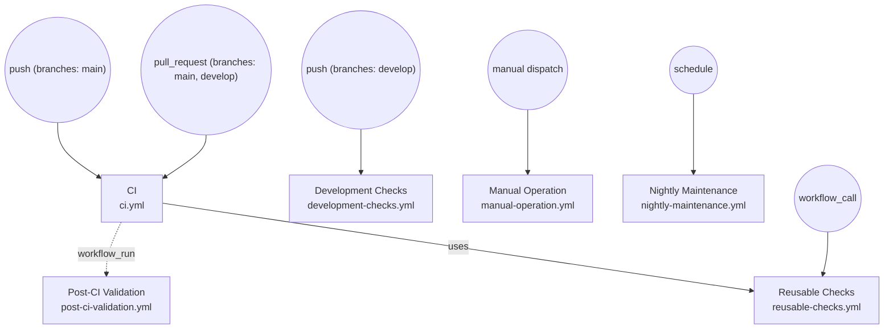

# Workflow Trigger Map

```mermaid
flowchart TD
    ci_yml["CI<br/>ci.yml"]
    development_checks_yml["Development Checks<br/>development-checks.yml"]
    manual_operation_yml["Manual Operation<br/>manual-operation.yml"]
    nightly_maintenance_yml["Nightly Maintenance<br/>nightly-maintenance.yml"]
    post_ci_validation_yml["Post-CI Validation<br/>post-ci-validation.yml"]
    reusable_checks_yml["Reusable Checks<br/>reusable-checks.yml"]
    ci_yml_push(("push (branches: main)")) --> ci_yml
    ci_yml_pull_request(("pull_request (branches: main, develop)")) --> ci_yml
    development_checks_yml_push(("push (branches: develop)")) --> development_checks_yml
    manual_operation_yml_workflow_dispatch(("manual dispatch")) --> manual_operation_yml
    nightly_maintenance_yml_schedule(("schedule")) --> nightly_maintenance_yml
    reusable_checks_yml_workflow_call(("workflow_call")) --> reusable_checks_yml
    ci_yml -. workflow_run .-> post_ci_validation_yml
    ci_yml -- uses --> reusable_checks_yml
```
